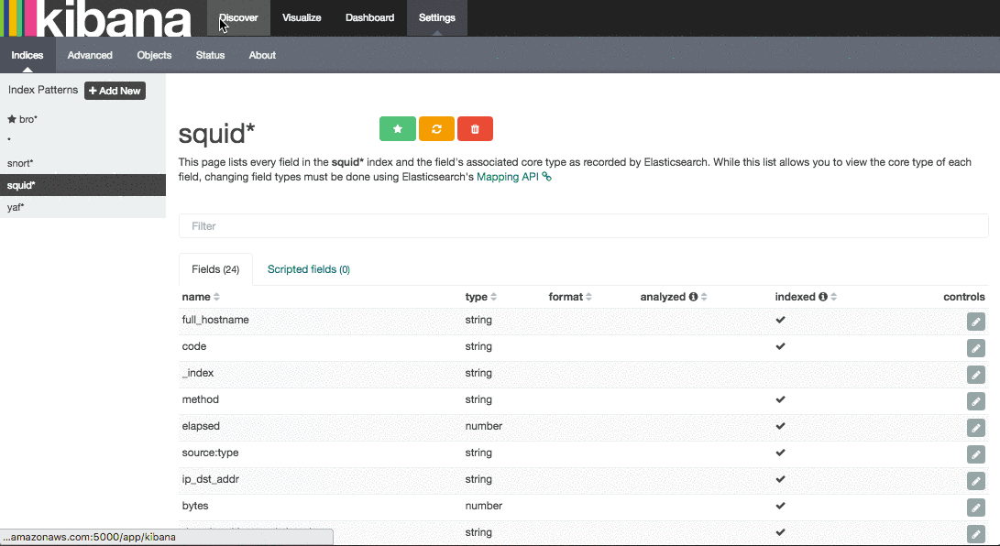

This article will introduce Metron's default dashboard that is built upon Kibana 4.  It will cover the elements present in the dashboard and how you can extend the dashboard for your own purposes.

### Metron's Dashboard

Metron's default dashboard is intended to allow you to easily validate the end-to-end functioning of Metron with its default sensor suite.  It highlights some of the useful widgets available in Kibana 4, and serves as a starting point for you to build your own customized dashboards.


The first panel in the dashboard highlights the variety of events being consumed by Metron.  It shows the total number of events received, the variety of those events, and a histogram showing when the events were received.


The next set of dashboard panels shows how Apache Metron can be used to perform real-time enrichment of telemetry data.  All of the IPv4 data received by Metron was cross-referenced against a geo-ip database.  These locations were then used to build this set of dashboard widgets.


As part of the default sensor suite, [YAF](https://tools.netsa.cert.org/yaf/) is used to generate flow records. These flow records provide significant visibility into which actors are communicating over the target network.  A table widget displays the raw details of each flow record.  A histogram of the duration of each flow shows that while most flows are relatively short-lived there are a few that are exceptionally longer in this example.  Creating an index template that defined this field as numeric was required to generate the histogram.


[Snort](https://www.snort.org/) is a Network Intrusion Detection System (NIDS) that is being used to generate alerts identifying known bad events. Snort relies on a fixed set of rules that act as signatures for identifying abnormal events.  Along with displaying the relevant details of each alert, the panel shows that there is only a single unique alert type; a test rule that creates a Snort alert on every network packet.  Another table was created to show source/destination pairs that generated the most Snort alerts.


The [Bro Network Security Monitor](https://www.bro.org/) is extracting application-level information from raw network packets. In this example, Bro is extracting HTTP and HTTPS requests being made over the network.  The panels highlight the breakdown by request type, the total number of web requests, and raw details from each web request.


Bro is extracting DNS requests and responses being made over the network. Understanding who is making those requests, the frequency, and types can provide a deep understanding of the actors present on the network.

### Creating Your Own Dashboard

Now that you understand Metron's default dashboard, let's cover how you might extend this dashboard for your own purposes.  We will continue the ongoing example of parsing Squid Proxy logs.  The dashboard will be extended to display the Squid log data.  

TODO Links to the previous blog posts covering these examples.

#### Enhancing the Squid Data

The previous tutorials covering Squid produced a very limit data set; effectively a few requests to the CNN web site.  To make this tutorial a little more interesting, we are going to need a bit more variety in our sample data.

Run the following series of commands in a terminal.  This will download the Top 1 Million web sites as defined by Alexa and then randomly make requests against a subet of those sites.

WARNING: The sites that people choose to visit

```
curl -O http://s3.amazonaws.com/alexa-static/top-1m.csv.zip
unzip top-1m.csv.zip
while sleep 2; do head -10 top-1m.csv | shuf -n 1 | awk -F, '{print $2}' | xargs -i squidclient -g 4 -v "http://{}"; done
```

#### Squid Sensor

As before.... On Sensor host maintain a session running the following...

```
tail -F /var/log/squid/access.log | /usr/hdp/current/kafka-broker/bin/kafka-console-producer.sh --broker-list ec2-50-112-203-38.us-west-2.compute.amazonaws.com:6667 --topic squid
```

Validate

```
/usr/hdp/current/kafka-broker/bin//kafka-console-consumer.sh --zookeeper ec2-52-37-196-70.us-west-2.compute.amazonaws.com:2181 --topic squid --from-beginning
```

#### Configure Squid Enrichment

Upload enrichment config

```
{
  "index": "squid",
  "batchSize": 5,
  "enrichment" : { },
  "threatIntel": { }
}
```

Upload configurations...

```
bin/zk_load_configs.sh --mode PUSH -i /usr/metron/*/config/zookeeper -z ec2-52-37-196-70.us-west-2.compute.amazonaws.com:2181
```

Validate...

```
/usr/hdp/current/zookeeper-client/bin/zkCli.sh -server ec2-52-37-196-70.us-west-2.compute.amazonaws.com:2181
```

TODO Missing configuration of enrichment config at https://cwiki.apache.org/confluence/pages/viewpage.action?pageId=62693950

#### Start Topology

```
/usr/metron/0.1BETA/bin/start_parser_topology.sh \
  -k ec2-50-112-203-38.us-west-2.compute.amazonaws.com:6667 \
  -z ec2-52-37-196-70.us-west-2.compute.amazonaws.com:2181 \
  -s squid
```

#### Index Template

Create an index template for Squid

```
export ES_HOST="ec2-52-40-44-64.us-west-2.compute.amazonaws.com:9200"
curl -s -XPOST $ES_HOST/_template/squid_index -d @squid_index.template
```

#### Define Index in Kibana


#### Review the Data



#### Visualize


