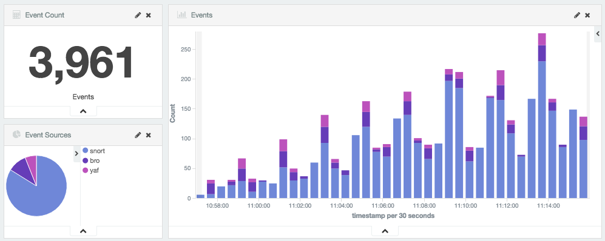
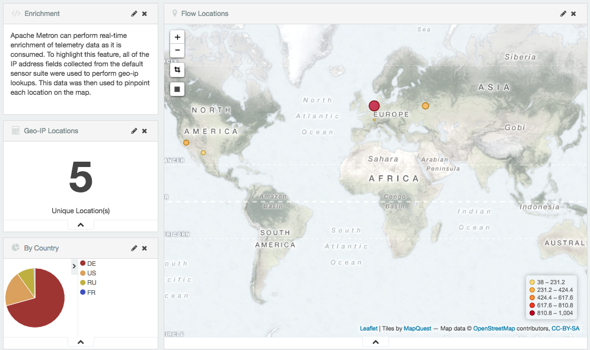
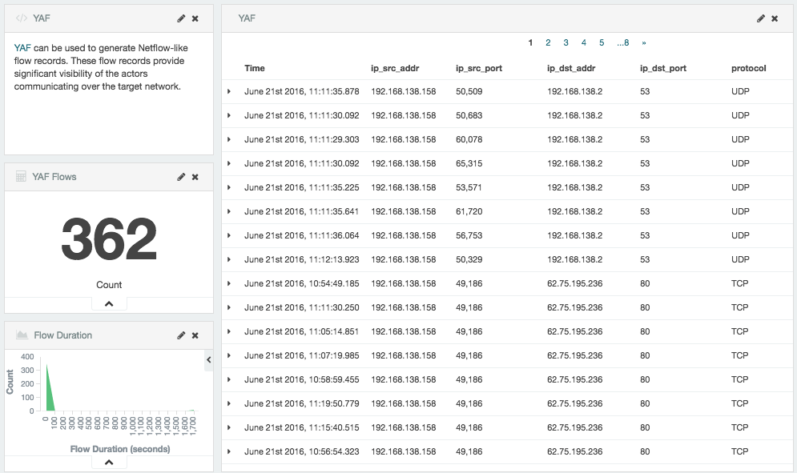
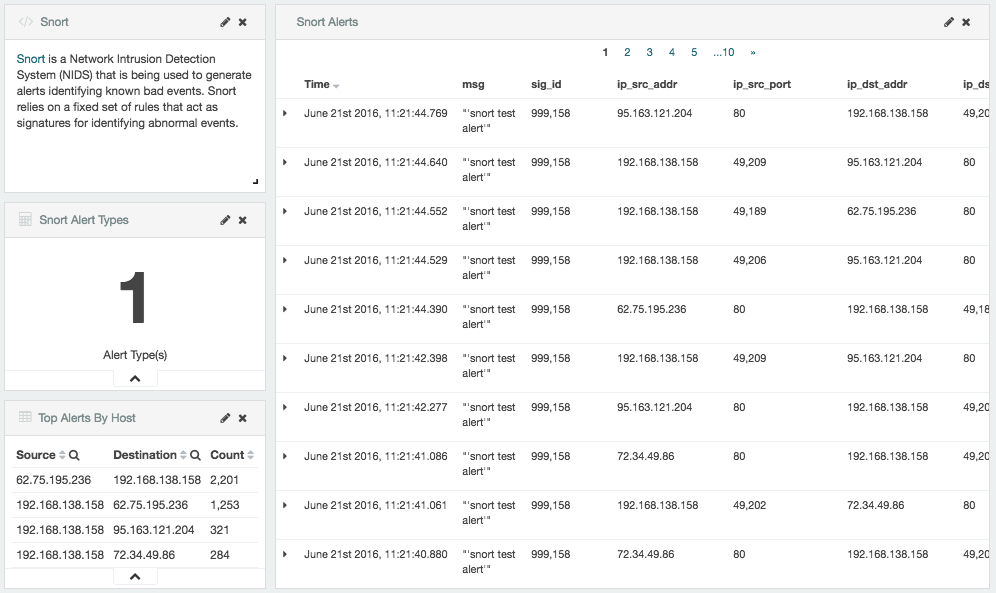
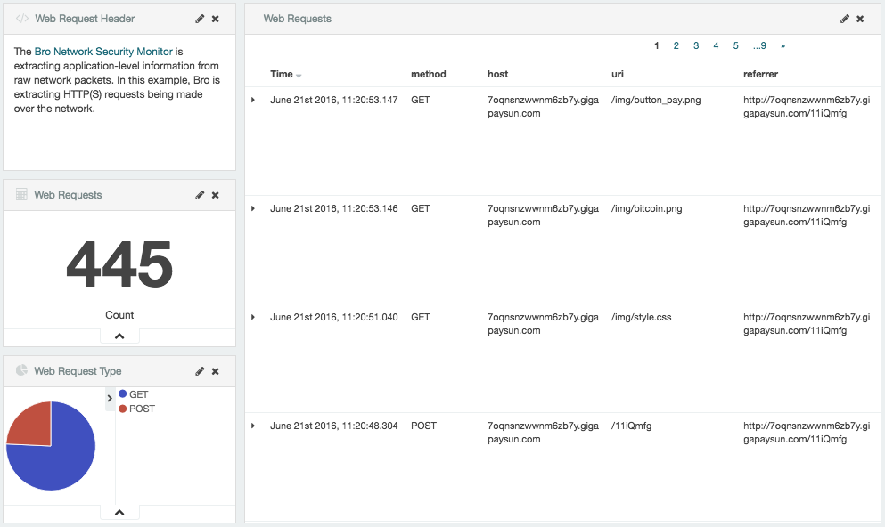
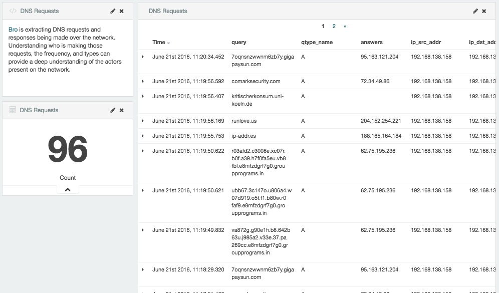
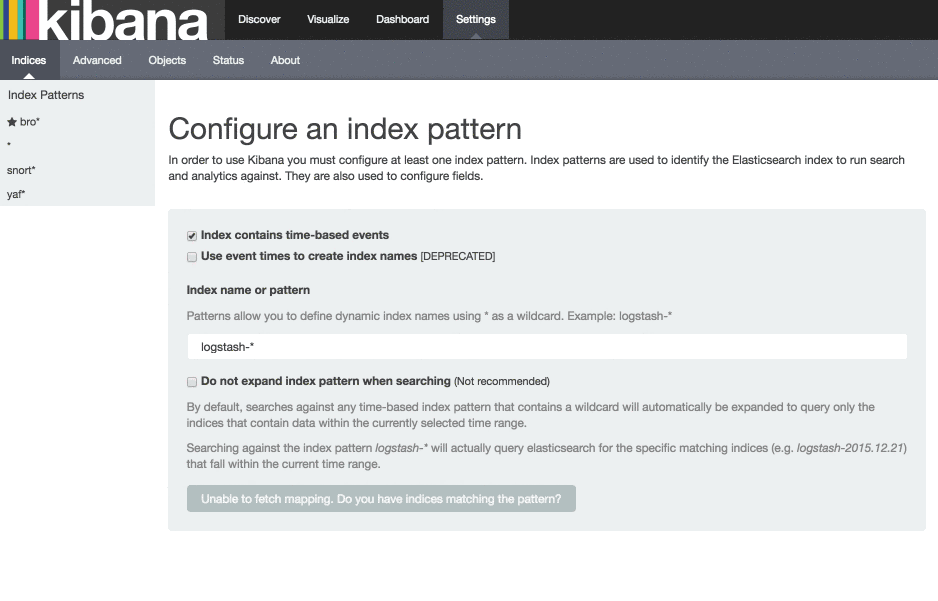
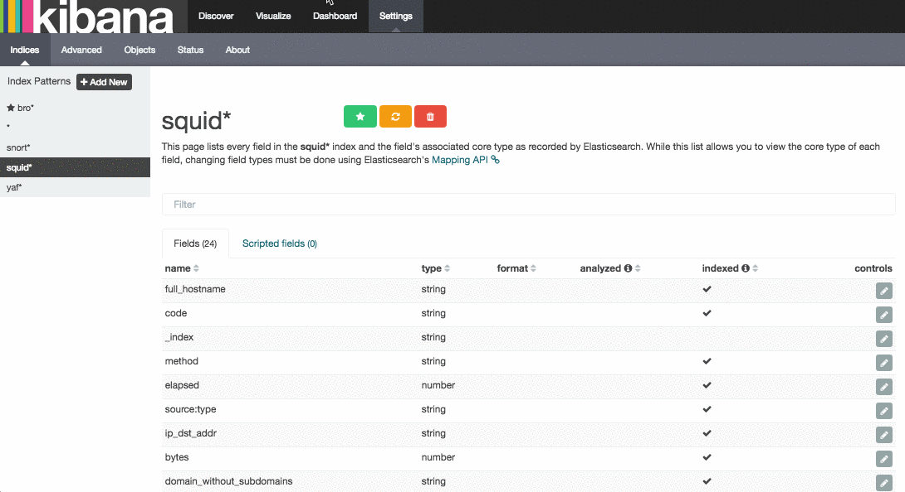
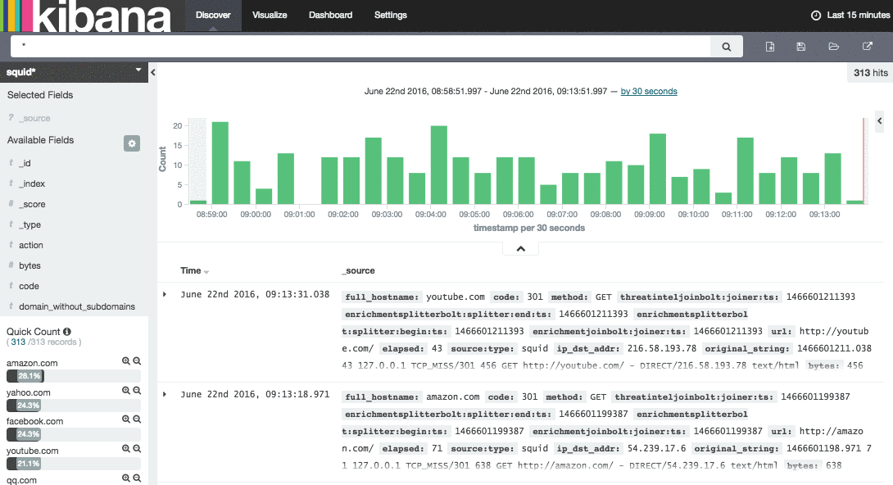
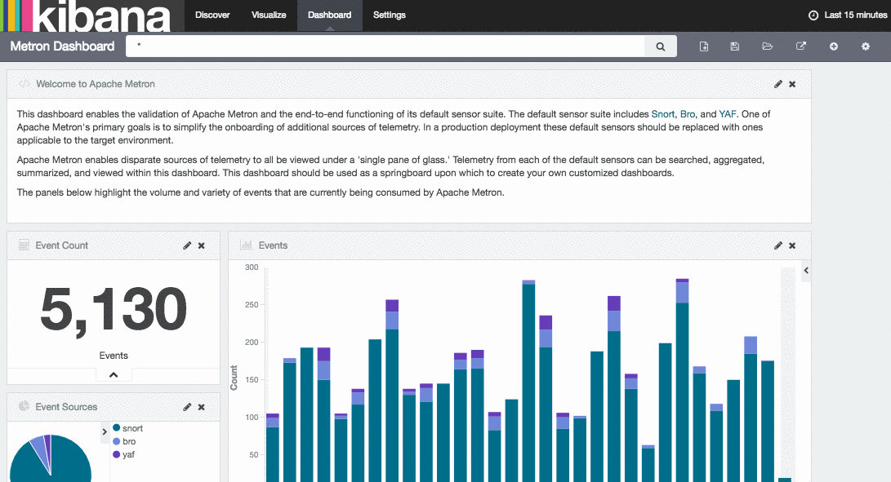

This article will introduce Metron's default dashboard that is built upon Kibana 4.  It will cover the elements present in the dashboard and how you can extend the dashboard for your own purposes.

### Metron's Dashboard

Metron's default dashboard is intended to allow you to easily validate the end-to-end functioning of Metron with its default sensor suite.  It highlights some of the useful widgets available in Kibana 4, and serves as a starting point for you to build your own customized dashboards.



The first panel in the dashboard highlights the variety of events being consumed by Metron.  It shows the total number of events received, the variety of those events, and a histogram showing when the events were received.



The next set of dashboard panels shows how Apache Metron can be used to perform real-time enrichment of telemetry data.  All of the IPv4 data received by Metron was cross-referenced against a geo-ip database.  These locations were then used to build this set of dashboard widgets.



As part of the default sensor suite, [YAF](https://tools.netsa.cert.org/yaf/) is used to generate flow records. These flow records provide significant visibility into which actors are communicating over the target network.  A table widget displays the raw details of each flow record.  A histogram of the duration of each flow shows that while most flows are relatively short-lived there are a few that are exceptionally longer in this example.  Creating an index template that defined this field as numeric was required to generate the histogram.



[Snort](https://www.snort.org/) is a Network Intrusion Detection System (NIDS) that is being used to generate alerts identifying known bad events. Snort relies on a fixed set of rules that act as signatures for identifying abnormal events.  Along with displaying the relevant details of each alert, the panel shows that there is only a single unique alert type; a test rule that creates a Snort alert on every network packet.  Another table was created to show source/destination pairs that generated the most Snort alerts.



The [Bro Network Security Monitor](https://www.bro.org/) is extracting application-level information from raw network packets. In this example, Bro is extracting HTTP and HTTPS requests being made over the network.  The panels highlight the breakdown by request type, the total number of web requests, and raw details from each web request.



Bro is extracting DNS requests and responses being made over the network. Understanding who is making those requests, the frequency, and types can provide a deep understanding of the actors present on the network.

### Creating Your Own Dashboard

Now that you understand Metron's default dashboard, let's cover how you might extend this dashboard for your own purposes.  We will continue the ongoing example of parsing Squid Proxy logs.  The dashboard will be extended to display the Squid log data.  

**TODO** Links to the previous blog posts covering these examples.

#### Enhance the Squid Data

The previous tutorials covering Squid produced a limited data set.  These consisted of a few basic requests.  To make this tutorial more interesting, we are going to need a bit more variety in the sample data.

Open a terminal and run the following series of commands.  This will download a list of the top 1 million sites as defined by Alexa.  This will continually choose one at random and make a request through Squid for that web site.  Leave this command running on the host so that a continual feed of data is generated as we work through the remainder of this tutorial.

```
curl -O http://s3.amazonaws.com/alexa-static/top-1m.csv.zip
unzip top-1m.csv.zip
while sleep 2; do head -10 top-1m.csv | shuf -n 1 | awk -F, '{print $2}' | xargs -i squidclient -g 4 -v "http://{}"; done
```

* **TODO** need to alter this process so that it has a multiple-level TLD (bbc.co.uk) and a complex URI resource

The previous command is generating log records at `/var/log/squid/access.log`.  Run the following command in another terminal to extract this data and publish it to Kafka. Again, leave this command running to generate that continuous feed of data.

```
tail -F /var/log/squid/access.log | /usr/hdp/current/kafka-broker/bin/kafka-console-producer.sh --broker-list ec2-50-112-203-38.us-west-2.compute.amazonaws.com:6667 --topic squid
```

Ensure that the parser topology for Squid continues to run based on the steps outlined in the previous tutorials.

#### Create an Index Template

To work with the Squid data in Kibana, we need to ensure that the data is landing in the search index with the correct data types.  This can be achieved by defining an index template.  

1. Run the following command to create an index template for Squid.
  ```
  curl -XPOST ec2-52-40-44-64.us-west-2.compute.amazonaws.com:9200/_template/squid_index -d '
  {
    "template": "squid_index*",
    "mappings": {
      "bro_doc": {
        "_timestamp": {
          "enabled": true
        },
        "properties": {
          "timestamp": {
            "type": "date",
            "format": "epoch_millis"
          },
          "source:type": {
            "type": "string",
            "index": "not_analyzed"
          },
          "action": {
            "type": "string",
            "index": "not_analyzed"
          },
          "bytes": {
            "type": "integer"
          },
          "code": {
            "type": "string",
            "index": "not_analyzed"
          },
          "domain_without_subdomains": {
            "type": "string",
            "index": "not_analyzed"
          },
          "full_hostname": {
            "type": "string",
            "index": "not_analyzed"
          },
          "elapsed": {
            "type": "integer"
          },
          "method": {
            "type": "string",
            "index": "not_analyzed"
          },
          "ip_dst_addr": {
            "type": "string",
            "index": "not_analyzed"
          }
        }
      }
    }
  }'
  ```

2. By default, Elasticsearch will attempt to analyze all fields of type string.  This means that Elasticsearch will tokenize the string and perform additional processing to enable free-form text search.  In many cases, and all cases for the Squid data, we want to treat each of the string fields as enumerations.  This is why most fields in the index template are `not_analyzed`.

3. An index template will only apply for indices that are created after the template is created.  Delete the existing Squid indices so that new ones can be generated with the index template.
  ```
  curl -XDELETE node1:9200/squid*
  ```

4. Wait for the Squid index to be re-created.  This may take a minute or two based on how fast the Squid data is being consumed in your environment.
```
curl -XGET node1:9200/squid*
```

#### Configure the Squid Index in Kibana

Now that we have a Squid index with all of the right data types, we need to tell Kibana about this index.



1. Login to your Kibana user interface and then click on 'Settings', then 'Indices'.

2. A text field will prompt for the name of the index.  Type `squid*` within the text field.  Every hour or day, depending on the specific configuration, a new Squid index will be created.  Using this pattern will match against all Squid indices for all time periods.

3. Click outside of that text box and wait for the 'Time-field name' input field to populate.  Since there is only one timestamp in the index, this should default to a field called `timestamp`.  If this does not happen simply choose the field `timestamp`.  

4. Then click the 'Create' button.

#### Review the Data

Now that Kibana is aware of the new Squid index, let's take a look at the data.



1. Click on `Discover` and then choose the newly created `squid*` index pattern.  

2. By clicking any of the fields on the left menu, you can see a representation of the variety of data for that specific fields.

3. Clicking on a specific record will show each field available in the data.

#### Visualize

After using the `Discover` panel to better understand the Squid data, let's create a few visualizations.



1. Click on 'Visualize' in the top level menu.

2. Choose the 'Vertical bar chart' and when prompted to 'Select a search source' choose 'From a new search'.  Choose the `squid*` index pattern.

3. Under 'Select bucket types' click the 'X-Axis' and for the 'Aggregation' type choose 'Terms'.

4. Under 'Field' choose the `domain_without_subdomains` field.

5. Click the 'Play' button  to refresh the visualization.

6. Near the top-right side of the screen click on the 'Save' icon to save the visualization.  Name it something appropriate.  This will allow us to use the visualization in a dashboard later.

#### Customize the Dashboard



1. Open the Metron Dashboard by clicking on 'Dashboard' in the top-level menu.

2. On the right, click the 'Add' button indicated by a plus sign.

3. Find the visualization that you would like to add.

4. Scroll to the bottom of the dashboard to find the visualization that was added.  From here you can resize and move the visualization as needed.

### Summary

At this point you should be comfortable customizing a dashboard as you add new sources of telemetry to Metron. This article introduced Metron's default dashboard that is built upon Kibana 4.  It covered the elements present in the dashboard and how you can extend the dashboard for your own purposes. 
